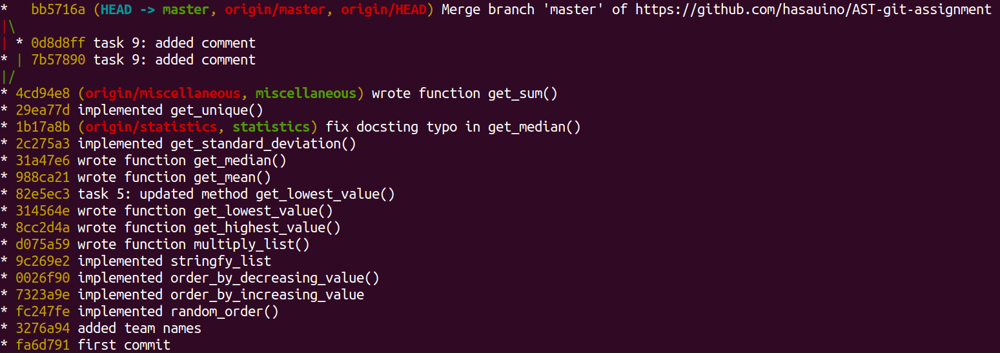

# Report
## Team members:
* Hassan Umari
* Hassan Umari (second GitHub account)

### Changes
| Change message | Author | Date & Hour | Lines changed |
--- | --- | --- | --- |--- |--- 
|first commit| Samuel Parra |30.10.2020 10:40| 52 (52+, 0-) |
|added team names| cloned-humari2s |11.11.2020 16:23| 8 (4+, 4-) |
|implemented random_order()| cloned-humari2s |11.11.2020 16:34| 15 (13+, 2-) |
|implemented order_by_increasing_value| cloned-humari2s |11.11.2020 16:35| 4 (3+, 1-) |
|implemented order_by_decreasing_value()| cloned-humari2s |11.11.2020 16:37| 4 (3+, 1-) |
|implemented stringfy_list| cloned-humari2s |11.11.2020 16:40| 6 (4+, 2-) |
|wrote function multiply_list()| hasauino |11.11.2020 16:44| 2 (1+, 1-) |
|wrote function get_highest_value()| hasauino |11.11.2020 16:47| 2(1+,1-) |
|wrote function get_lowest_value()| hasauino |11.11.2020 16:47| 2(1+,1-) |
|task 5: updated method get_lowest_value()| cloned-humari2s |13.11.2020 16:47| 5 (4+, 1-)    |
|wrote function get_mean()| hasauino |13.11.2020 21:05| 5 (5+, 0-) |
|wrote function get_median()| hasauino |13.11.2020 21:19| 10 (9+, 1-)   |
|implemented get_standard_deviation()| cloned-humari2s |13.11.2020 21:26| 7 (7+, 0-) |
|fix docsting typo in get_median()| hasauino |13.11.2020 21:27| 2 (1+, 1-) |
|implemented get_unique()| cloned-humari2s |13.11.2020 21:35| 7 (6+, 1-) |
|wrote function get_sum()| hasauino |13.11.2020 21:39| 5 (5+, 0-) |
|task 9: added comment| hasauino |13.11.2020 21:50| 1 (1+, 0-) |
|task 9: added comment| cloned-humari2s |3.11.2020 21:51| 1 (1+, 0-) |
|Merge branch 'master' of https://github.com/hasauino/AST-git-assignment| cloned-humari2s |3.11.2020 21:57| 2 (1+, 1-) |

Include a screeshot of the output of the command: `git log --oneline --graph --decorate --all
`           

### Merge Conflict

- What happened?

A merge conflict happened when I tried to pull the master branch. Team members pulled the latest changes before making any change. However, both committed at the same time (before any of them pushed), the second member who tries to push will be prompted by git that his local branch is lagging behind the remote branch. Git tries to do an automatic merge, it failed in this case since the changes are made to the same line, hence a manual merge-resolve was needed.

-  How did you resolve it?

The merge conflict was resolved manually by editing the file in a text editor (which had the conflict), keeping the line I wanted and deleting the other (after agreement). Then committed and pushed.  

